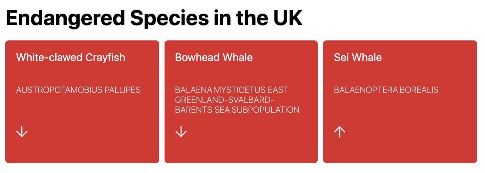

# React

## Endangered Species

### Initial problem

Roberta works at a zoo and wants to show a list of endangered species in the UK. She has found an API to provide data about the endangered species.

A skeleton React app has been generated for you (using Create React App) here: [https://codesandbox.io/s/react-assessment-starting-point-qmiff](https://codesandbox.io/s/react-assessment-starting-point-qmiff). It includes some example data (in the `fake-endangered-species.json` file) from the API.

#### Step 1

Use the example data to complete the React app and display the endangered species. Make sure that it adds the correct classes to the DOM, so that it looks something like this:

#### Step 2

Then modify the app so that it loads data from the API instead.

The API documentation is available at **TODO**.

### Stretch goals

Ask the trainee to consider loading states and error handling. (There are some styles provided in the CSS).

### Potential stumbling blocks

- Trainees should have all the building blocks to get started, but might struggle to understand what is provided and what is needed. If they are flailing, start by walking through the existing app and discussing what it does
  - The first step should be to create a new `Species` component function, exported from `Species.js`, imported into `App.js` and rendered into the `App` component.
- The focus of this exercise should be on React - not CSS - so guide trainees towards the comment which demonstrates the classes required to get it looking like the screenshot
  - *However*, trainees should notice that the comment uses the `class` syntax, not `className` which is what they have been taught to use. In actuality `class` does work too, but trainees should know to change them to `className`.
- Jumping directly into data fetching might be intimidating, so if trainees struggle help them by putting the example data in state first.
  - E.g. `const [endangeredSpecies, setEndangeredSpecies] = useState(fakeEndangeredSpecies)`
- A common mistake is to accidentally spam the API with requests because the `useEffect` is running on every render. Try to guide trainees to writing the `useEffect` "skeleton" first.
  - E.g. `useEffect(() => {}, [])`.
  - With the square brackets, the request will only be run on the initial render, limiting the number of API requests.
  - If the API is spammed with requests you may get 429 responses from the API. Unfortunately there isn't much you can do in this situation
- The trainees may notice that there are a few "UX" problems: nothing is displayed while the request is loading, and there is no error handling. This is good! However, try to guide them towards completing the "happy path" first so that they have a working app.
  - The "Stretch goals" section is intended to fix the problems described above.

### Expected time

Trainees should complete this task in around 30 - 45 minutes.

### Assessment

#### Things to not worry about

- Matching the styling from the screenshot exactly. The focus of the assessment should be on React and not CSS so if it's not pixel perfect, then that's ok.

#### Rubric

The trainee could write the `Species` component:

- (0) With a lot of prompting
- (1) With a small amount of prompting
- (2) With no prompting

The trainee could export and import the component:

- (0) With a lot of prompting
- (1) With a small amount of prompting
- (2) With no prompting

The trainee could added the correct `className`s to the component:

- (0) With a lot of prompting
- (1) With a small amount of prompting
- (2) With no prompting

The trainee could initialise state using `useState`:

- (0) With a lot of prompting
- (1) With a small amount of prompting
- (2) With no prompting

The trainee could write a correct `useEffect` "skeleton":

- (0) With a lot of prompting
- (1) With a small amount of prompting
- (2) With no prompting

The trainee could fetch data from the API:

- (0) With a lot of prompting
- (1) With a small amount of prompting
- (2) With no prompting

The trainee could store API data in state:

- (0) With a lot of prompting
- (1) With a small amount of prompting
- (2) With no prompting

The trainee rendered a loading state:

- (0) With a lot of prompting
- (1) With a small amount of prompting
- (2) With no prompting
- (n/a) Didn't get this far

The trainee handled errors

- (0) With a lot of prompting
- (1) With a small amount of prompting
- (2) With no prompting
- (n/a) Didn't get this far

The trainee could debug issues which came up:

- (0) With a lot of prompting.
- (1) With a small amount of prompting.
- (2) With no prompting.
- (n/a) No problems needed debugging.

Naming and code structure were:

- (0) Unclear/confusing
- (1) Intelligible
- (2) Clear/helpful

### Wrapping up

Make sure your trainee has a working solution; you can either complete theirs, or share the sample solution with them. You may also want to suggest ways to improve the solution further.
